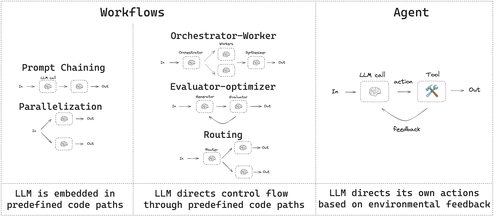
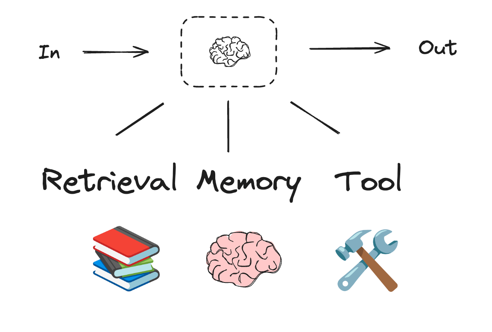
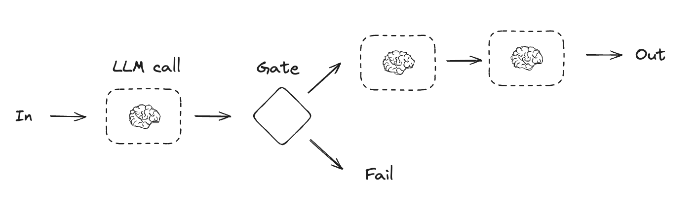
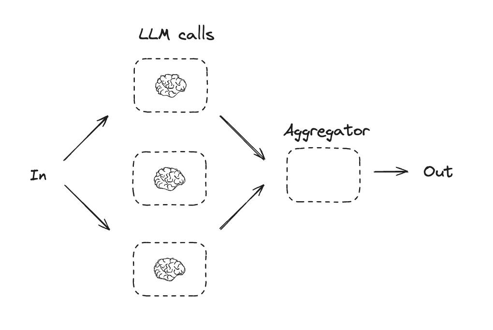
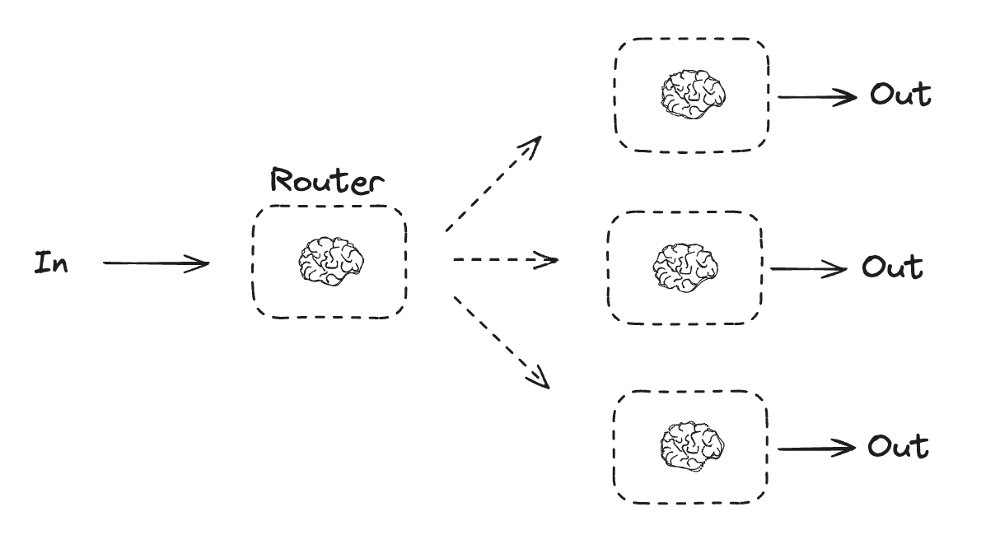
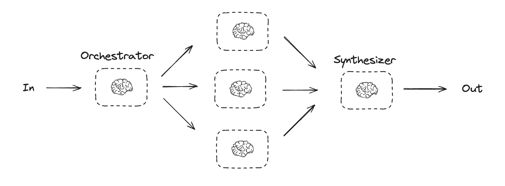
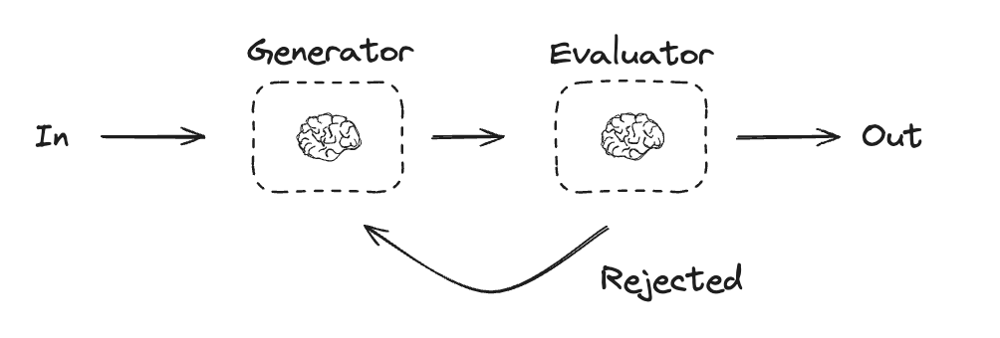
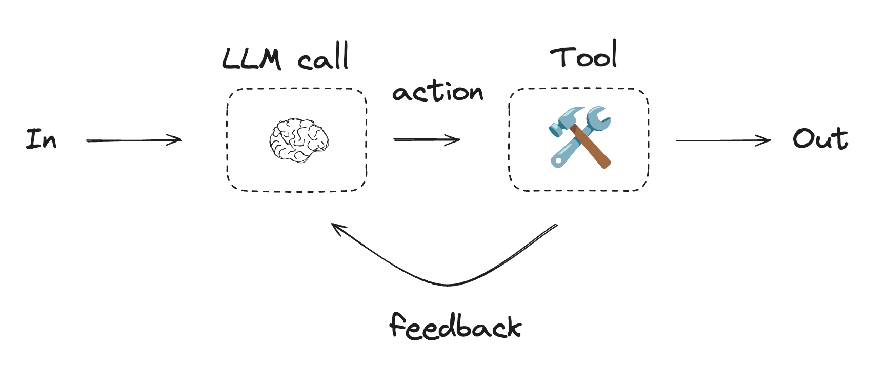

# LangGraph 学习笔记 02：工作流模式、Agent 模式与本地运行

> 说明：
> 本笔记继续基于 `Get-started` 目录中的官方文档整理，重点覆盖 `Workflows and agents` 与 `Run a local server`。
> 第一篇更偏“心法”，这一篇更偏“模式识别”和“落地实践”。

---

## 1. 先理解一个总原则：Workflow 和 Agent 不是一回事

官方 `Workflows and agents` 一开头就给出区分：

- Workflow：代码路径预先确定，按设定顺序执行。
- Agent：过程是动态的，模型会自己决定下一步、工具使用方式和部分流程。

这个区分非常重要，因为很多人在写 Agent 时其实做的是 Workflow，只是名字叫 agent。

从工程角度可以这样理解：

- 如果你的流程可预先定义，而且变化不大，优先考虑 workflow。
- 如果你的任务需要根据输入、上下文、工具结果动态规划，才更像 agent。

官方文档并不是在鼓励“所有事情都 agent 化”，反而是在强调：

> 先选最简单、最稳定的结构，只有当固定流程不够时，再增加 agent 的自由度。

这是一种很成熟的系统设计态度。



---

## 2. LLM 增强：LangGraph 图里的“智能”和“动作”来自哪里

官方在 `LLMs and augmentations` 这一节强调，工作流和 agent 系统通常建立在“被增强过的 LLM”之上。常见增强包括：

- Tool calling
- Structured outputs
- Short-term memory

这可以理解为，LLM 本身只是一个生成器，但在工程中我们通常给它加上几层能力：

1. 结构化输出，让它按 schema 说话
2. 工具调用，让它能提出动作请求
3. 记忆机制，让它记住上下文



### 2.1 为什么结构化输出很重要

官方示例里先用 Pydantic 定义 `SearchQuery`，再让 LLM 输出匹配这个 schema 的结果。

这说明在 LangGraph 里，很多节点并不只是为了“说一段自然语言”，而是为了产出可被后续节点消费的数据结构。

从学习角度，这一节透露了一个很关键的设计原则：

> 节点之间最好传结构，而不是传模糊的自然语言。

官方在这一节给出的结构化输出与工具调用代码如下：

```python
from pydantic import BaseModel, Field


class SearchQuery(BaseModel):
    search_query: str = Field(None, description="Query that is optimized web search.")
    justification: str = Field(
        None, description="Why this query is relevant to the user's request."
    )


structured_llm = llm.with_structured_output(SearchQuery)
output = structured_llm.invoke("How does Calcium CT score relate to high cholesterol?")


def multiply(a: int, b: int) -> int:
    return a * b


llm_with_tools = llm.bind_tools([multiply])
msg = llm_with_tools.invoke("What is 2 times 3?")
msg.tool_calls
```

### 2.2 为什么工具调用很重要

官方示例里把一个简单 `multiply` 工具绑到模型上，然后读取 `msg.tool_calls`。

这个模式和 quickstart 是一致的：

- 模型负责提出工具调用
- 系统负责执行

这意味着 Agent 的“行动能力”不是来自模型自己，而是来自模型与工具执行框架的配合。

---

## 3. Prompt Chaining：最适合初学者掌握的第一种模式

官方先讲的是 `Prompt chaining`。

### 3.1 它是什么

Prompt chaining 指：

- 一个 LLM 调用的输出，成为下一个 LLM 调用的输入
- 整个过程按一系列可验证的小步骤推进

适合场景包括：

- 翻译与再加工
- 先生成，再检查，再优化
- 明确可以拆成多段的内容生成任务



### 3.2 官方示例在做什么

官方示例大意是：

1. 先生成一个笑话
2. 检查它有没有 punchline
3. 如果不够好，就改进
4. 再进行润色

这个模式体现了 workflow 的典型特征：

- 节点顺序基本明确
- 只有局部分支
- 每一步职责清楚

### 3.3 这种模式为什么很实用

它的优势在于：

1. 可控性强
2. 每一步都容易单独调试
3. 某一步效果不好时容易替换
4. 比“一个超长 prompt 解决全部问题”更稳定

### 3.4 学习者该怎么用

当你碰到下面这类任务时，优先考虑 prompt chaining：

- 文本生成后再校对
- 先摘要再分类
- 先提取结构化信息，再生成最终答案
- 先粗写，再细修

如果你一上来就用大 agent，让模型自己决定所有步骤，很多时候反而更不稳定。

官方给出的 Graph API 版 Prompt Chaining 核心代码如下：

```python
from typing_extensions import TypedDict
from langgraph.graph import StateGraph, START, END
from IPython.display import Image, display


class State(TypedDict):
    topic: str
    joke: str
    improved_joke: str
    final_joke: str


def generate_joke(state: State):
    msg = llm.invoke(f"Write a short joke about {state['topic']}")
    return {"joke": msg.content}


def check_punchline(state: State):
    if "?" in state["joke"] or "!" in state["joke"]:
        return "Pass"
    return "Fail"


def improve_joke(state: State):
    msg = llm.invoke(f"Make this joke funnier by adding wordplay: {state['joke']}")
    return {"improved_joke": msg.content}


def polish_joke(state: State):
    msg = llm.invoke(f"Add a surprising twist to this joke: {state['improved_joke']}")
    return {"final_joke": msg.content}


workflow = StateGraph(State)
workflow.add_node("generate_joke", generate_joke)
workflow.add_node("improve_joke", improve_joke)
workflow.add_node("polish_joke", polish_joke)
workflow.add_edge(START, "generate_joke")
workflow.add_conditional_edges(
    "generate_joke", check_punchline, {"Fail": "improve_joke", "Pass": END}
)
workflow.add_edge("improve_joke", "polish_joke")
workflow.add_edge("polish_joke", END)

chain = workflow.compile()
display(Image(chain.get_graph().draw_mermaid_png()))
```

---

## 4. Parallelization：让多个分支同时工作

官方第二个模式是 `Parallelization`。

### 4.1 它是什么

并行化指：

- 同时运行多个独立子任务
- 或者对同一任务做多次评估，再聚合结果

适用场景例如：

- 一边抽关键词，一边查格式错误
- 同时生成故事、笑话、诗歌
- 并行做多个评分维度



### 4.2 官方示例在做什么

示例中从同一个 `topic` 出发，同时生成：

- joke
- story
- poem

最后由 `aggregator` 汇总。

这说明在 LangGraph 中：

- 多个节点可以从 `START` 同时出发
- 再在后续节点汇合

### 4.3 并行化的真正价值

它的价值不只是“更快”，还有：

1. 把多个独立思路拆开
2. 降低单次 prompt 过载
3. 允许不同节点使用不同 prompt 或不同模型
4. 为后续投票、融合、排序创造条件

### 4.4 学习提醒

并行化不是越多越好。你需要先确认：

- 分支之间是不是相互独立
- 聚合逻辑是不是清楚
- 并行成本是否值得

否则就会变成“结构更复杂，但效果没更好”。

官方给出的 Graph API 版并行化核心代码如下：

```python
class State(TypedDict):
    topic: str
    joke: str
    story: str
    poem: str
    combined_output: str


def call_llm_1(state: State):
    msg = llm.invoke(f"Write a joke about {state['topic']}")
    return {"joke": msg.content}


def call_llm_2(state: State):
    msg = llm.invoke(f"Write a story about {state['topic']}")
    return {"story": msg.content}


def call_llm_3(state: State):
    msg = llm.invoke(f"Write a poem about {state['topic']}")
    return {"poem": msg.content}


def aggregator(state: State):
    combined = f"Here's a story, joke, and poem about {state['topic']}!\n\n"
    combined += f"STORY:\n{state['story']}\n\n"
    combined += f"JOKE:\n{state['joke']}\n\n"
    combined += f"POEM:\n{state['poem']}"
    return {"combined_output": combined}


parallel_builder = StateGraph(State)
parallel_builder.add_node("call_llm_1", call_llm_1)
parallel_builder.add_node("call_llm_2", call_llm_2)
parallel_builder.add_node("call_llm_3", call_llm_3)
parallel_builder.add_node("aggregator", aggregator)
parallel_builder.add_edge(START, "call_llm_1")
parallel_builder.add_edge(START, "call_llm_2")
parallel_builder.add_edge(START, "call_llm_3")
parallel_builder.add_edge("call_llm_1", "aggregator")
parallel_builder.add_edge("call_llm_2", "aggregator")
parallel_builder.add_edge("call_llm_3", "aggregator")
parallel_builder.add_edge("aggregator", END)

parallel_workflow = parallel_builder.compile()
```

---

## 5. Routing：根据输入类型选择不同路径

官方第三个重要模式是 `Routing`。

### 5.1 它是什么

Routing 指：

- 先对输入做判断
- 再把请求送去不同分支

典型场景：

- 问题类走知识检索
- bug 类走工单创建
- 紧急类走人工审核



### 5.2 为什么它比“一个万能节点”更好

如果你把所有任务都交给一个模型节点处理，会遇到：

- prompt 变得臃肿
- 可控性差
- 错误难定位

Routing 的好处是：

1. 先分类
2. 再交给更专门的后续链路

这和传统软件里的“分发器”很像，只不过这里分类动作经常由 LLM 承担。

### 5.3 学习者应该怎么判断是否需要路由

当你发现：

- 不同输入类型需要完全不同工具
- 不同输入类型需要完全不同 prompt
- 后续步骤差异很大

那通常就应该引入 routing。

---

## 6. Orchestrator-worker：把复杂任务拆给多个工作单元

官方继续给出 `Orchestrator-worker` 模式。

### 6.1 它是什么

这类模式的核心是：

- 一个 orchestrator 负责任务分解
- 多个 worker 负责处理子任务
- 再把结果收集起来

这特别适合：

- 报告生成
- 多段内容编写
- 多视角分析
- 大任务拆分



### 6.2 它和普通并行化的区别

普通并行化通常是开发者预先定义好几条并行分支。

而 orchestrator-worker 往往更动态：

- 先由上层节点决定要拆成哪些子任务
- 再创建 worker 去处理

所以它比简单 parallelization 更“agentic”一点。

### 6.3 这个模式为什么重要

它体现了 LangGraph 一个很强的方向：

> 不仅能编排固定节点，还能支撑“先规划，再分工，再汇总”的多角色协作过程。

这对复杂 agent 系统很关键。

### 6.4 学习建议

初学时不用急着自己实现动态 worker 创建，但要先理解它的抽象：

1. 任务分解
2. 子任务执行
3. 结果回收
4. 总结融合

以后做研究助手、报告助手、多文档分析时，这种模式会很常见。

---

## 7. Evaluator-optimizer：先生成，再评审，再改进

官方给出的另一个非常经典的模式是 `Evaluator-optimizer`。

### 7.1 它是什么

流程通常是：

1. 生成初稿
2. 评估结果
3. 如果不达标，继续优化
4. 达标后结束



### 7.2 它和 Prompt Chaining 的区别

Prompt chaining 更像预先排好的流水线。

Evaluator-optimizer 更像一个闭环：

- 生成
- 评价
- 反馈
- 再生成

也就是一种“自我改进循环”。

### 7.3 典型适用场景

- 写作润色
- 代码生成后检查
- 摘要质量提升
- SQL 生成与纠错

### 7.4 工程上的提醒

这个模式很好用，但要注意：

- 评价标准要尽量明确
- 否则优化循环容易无穷反复
- 最好设置终止条件、最大轮次、最低通过线

这虽然不是这篇官方文档大段展开的重点，但它是把模式真正用起来时很重要的工程补充。

---

## 8. Agents：为什么它比 workflow 更自由，也更难控

官方后面专门讲 `Agents`。

### 8.1 官方示例的核心结构

和 quickstart 类似，agent 模式一般包含：

- 一个模型节点
- 一个工具执行节点
- 一个循环判断逻辑

只不过在这里，文档更强调它作为一种通用 agent 结构。



### 8.2 Agent 的优势

- 灵活
- 能动态选择工具
- 能根据工具结果调整下一步
- 更适合开放式问题

### 8.3 Agent 的代价

- 更难预测
- 更难调试
- 更容易产生额外 token 成本
- 更依赖 prompt、工具设计和安全边界

所以官方整篇文档的潜台词其实是：

> 不要因为“agent 看起来高级”就滥用 agent。

很多任务用 workflow 更稳、更便宜、更容易维护。

---

## 9. ToolNode：官方预置的工具执行节点

在 `Workflows and agents` 的后面，官方专门介绍了 `ToolNode`。

### 9.1 它解决什么问题

`ToolNode` 是一个预构建节点，用于执行工具调用。

官方说明它能自动处理：

- 并行工具执行
- 错误处理
- 状态注入

这意味着如果你不想每次自己手写：

- 遍历 `tool_calls`
- 找工具
- 调用工具
- 包装返回消息

那就可以用 `ToolNode`。

### 9.2 它适合什么时候用

适合：

- 你已经有标准 tool-calling 流程
- 你希望减少样板代码
- 你想更快搭出标准 agent graph

### 9.3 官方特别强调的一点：工具如何读 state 和 context

`ToolNode` 并不只是执行参数，它还支持工具通过 `ToolRuntime` 读取：

- 当前 graph state
- 当前 run 的 context

这说明工具不一定只能拿模型生成的参数，也可以拿到图运行时的其他上下文。

这个能力很重要，因为现实项目中经常会有：

- 当前用户 ID
- 组织 ID
- 权限信息
- 会话级配置

这些东西不一定应该全都由模型生成，但工具执行时又确实需要。

### 9.4 学习建议

初学时建议你先手写一次 tool node，再去理解 `ToolNode`。这样你会更明白它在帮你抽象什么。

官方文档中的 `ToolNode` 最小示例如下：

```python
from langchain.tools import tool
from langgraph.prebuilt import ToolNode
from langgraph.graph import MessagesState, StateGraph


@tool
def search(query: str) -> str:
    """Search for information."""
    return f"Results for: {query}"


@tool
def calculator(expression: str) -> str:
    """Evaluate a math expression."""
    return str(eval(expression))


builder = StateGraph(MessagesState)
builder.add_node("tools", ToolNode([search, calculator]))
graph = builder.compile()
```

官方还给了一个“工具读取 graph state 和 run context”的示例，这段也很值得保留：

```python
from dataclasses import dataclass

from langchain.messages import AIMessage
from langchain.tools import ToolRuntime, tool
from langgraph.graph import MessagesState, START, StateGraph
from langgraph.prebuilt import ToolNode


class State(MessagesState):
    user_id: str


@dataclass
class Context:
    organization_id: str


@tool
def get_user_info(runtime: ToolRuntime[Context, State]) -> str:
    user_id = runtime.state["user_id"]
    organization_id = runtime.context.organization_id
    return f"User {user_id} in organization {organization_id}"


builder = StateGraph(State, context_schema=Context)
builder.add_node("tools", ToolNode([get_user_info]))
builder.add_edge(START, "tools")
graph = builder.compile()

result = graph.invoke(
    {
        "messages": [
            AIMessage(
                content="",
                tool_calls=[
                    {
                        "name": "get_user_info",
                        "args": {},
                        "id": "call_user_info",
                    }
                ],
            )
        ],
        "user_id": "user_123",
    },
    context=Context(organization_id="org_456"),
)
```

---

## 10. Run a local server：把 LangGraph 从“代码”变成“本地可交互服务”

官方 `Run a local server` 讲的是本地运行 LangGraph 应用。

### 10.1 前置条件

官方要求至少准备：

- LangSmith API Key

同时从安装命令看，CLI 部分要求：

- Python 3.11+

### 10.2 安装 LangGraph CLI

官方给出的方式是：

```bash
pip install -U "langgraph-cli[inmem]"
```

这里的 `inmem` 表示内存模式，适合本地开发测试。

### 10.3 创建新应用

官方建议用模板创建项目：

```bash
langgraph new path/to/your/app --template new-langgraph-project-python
```

这说明 LangGraph 不只是一个库，也在逐步提供更完整的应用启动脚手架。

### 10.4 安装依赖并配置 `.env`

官方流程包括：

1. 进入 app 根目录
2. 安装依赖
3. 从 `.env.example` 复制为 `.env`
4. 配置 `LANGSMITH_API_KEY`

这意味着本地运行 server 的体验与普通 Python 包调用不完全一样，它已经带有“应用工程”的味道。

官方示例里的依赖安装命令如下：

```bash
cd path/to/your/app
pip install -e .
```

`.env` 文件最小示例：

```bash
LANGSMITH_API_KEY=lsv2...
```

### 10.5 启动本地服务

官方命令：

```bash
langgraph dev
```

启动后通常会给出：

- API 地址
- Studio UI 地址
- API Docs 地址

这里最值得注意的是官方提供的 Studio 入口。

### 10.6 为什么 Studio 很重要

官方把 Studio 定义为一个可视化、可交互、可调试本地图应用的专门 UI。

这意味着你可以：

- 看图执行过程
- 看状态流动
- 调试节点行为
- 测试本地 agent

对于学习 LangGraph，这个能力非常重要，因为它能把“抽象图执行”变成可观察过程。

### 10.7 测试 API

官方给了三种方式：

1. Python SDK async
2. Python SDK sync
3. REST API

这说明本地 server 跑起来后，你的 graph 已经不只是“函数调用”，而是能作为服务端能力被外部客户端消费。

从工程视角看，这一步是从“原型代码”迈向“可部署应用”的关键过渡。

官方 Python SDK async 示例：

```python
from langgraph_sdk import get_client
import asyncio

client = get_client(url="http://localhost:2024")

async def main():
    async for chunk in client.runs.stream(
        None,
        "agent",
        input={
            "messages": [{
                "role": "human",
                "content": "What is LangGraph?",
            }],
        },
    ):
        print(f"Receiving new event of type: {chunk.event}...")
        print(chunk.data)
        print("\n\n")

asyncio.run(main())
```

官方 Python SDK sync 示例：

```python
from langgraph_sdk import get_sync_client

client = get_sync_client(url="http://localhost:2024")

for chunk in client.runs.stream(
    None,
    "agent",
    input={
        "messages": [{
            "role": "human",
            "content": "What is LangGraph?",
        }],
    },
    stream_mode="messages-tuple",
):
    print(f"Receiving new event of type: {chunk.event}...")
    print(chunk.data)
    print("\n\n")
```

官方 REST API 示例：

```bash
curl -s --request POST \
    --url "http://localhost:2024/runs/stream" \
    --header 'Content-Type: application/json' \
    --data "{
        \"assistant_id\": \"agent\",
        \"input\": {
            \"messages\": [
                {
                    \"role\": \"human\",
                    \"content\": \"What is LangGraph?\"
                }
            ]
        },
        \"stream_mode\": \"messages-tuple\"
    }"
```

---

## 11. Changelog 应该怎么看

`Changelog` 不适合作为第一轮学习主线，但很适合建立版本意识。

结合当前文档内容，可以注意到几个方向：

- `langgraph` 已经有 `v1.x` 系列
- 流式事件能力在继续演进
- 对超时、错误处理、优雅停机、checkpoint 开销控制等方面越来越重视

这透露出一个信号：

> LangGraph 并不只是“提示词编排工具”，它越来越像一个面向长生命周期 Agent 的运行时系统。

如果以后你进入生产应用，这些 changelog 信息会很重要；但在学习初期，知道它在持续演进就够了，不必一开始深挖所有版本细节。

---

## 12. 如何把这几种模式连成一张脑图

学习完 `Workflows and agents` 后，你可以把官方模式串成下面的理解：

1. Prompt chaining：线性分步处理
2. Parallelization：多个分支同时处理
3. Routing：根据输入条件分流
4. Orchestrator-worker：上层规划，下层分工
5. Evaluator-optimizer：生成与评估闭环
6. Agent：模型驱动的动态工具使用与流程推进

从简单到复杂，大致可以这样排序：

1. Prompt chaining
2. Routing
3. Parallelization
4. Evaluator-optimizer
5. Orchestrator-worker
6. Agent

注意，这不是官方原文给出的“难度排序”，而是结合学习路径做的整理。它的目的是帮助你循序渐进，而不是一次把所有模式混在一起。

---

## 13. 面向学习者的实践建议

### 13.1 第一阶段：只做最小图

建议先手写 3 类最小示例：

1. 一个线性 chaining 图
2. 一个 routing 图
3. 一个 tool-calling agent 图

只要能自己写出来，你对 LangGraph 的理解就已经比“只看文档”深很多了。

### 13.2 第二阶段：加入 state 设计和错误处理

重点练：

- state schema 怎么设计
- 哪些节点加 retry
- 哪些节点保留原始数据
- 哪些步骤要人工审核

### 13.3 第三阶段：跑本地 server + Studio

如果只在脚本里跑 invoke，你对 LangGraph 的理解还是有限。

真正建议做的是：

1. 建一个小 app
2. `langgraph dev`
3. 用 Studio 看执行过程

这一步会显著提升你对“图运行时”的直觉。

---

## 14. 这篇笔记对应的官方文档来源

本篇主要参考以下官方页面：

1. `docs/Get-started/Workflows-and-agents.html`
2. `docs/Get-started/Run-a-local-server.html`
3. `docs/Get-started/Changelog.html`

其中：

- 工作流模式、Agent 模式、`ToolNode` 主要来自 `Workflows and agents`
- 本地开发服务与 Studio 主要来自 `Run a local server`
- 版本演进意识主要参考 `Changelog`

---

## 15. 建议你的下一步学习顺序

如果你准备继续深学，建议顺序如下：

1. 把第一篇和第二篇笔记都过一遍
2. 手写 quickstart 里的 calculator agent
3. 自己改写一个 routing 示例
4. 再做一个带 `interrupt()` 的人工审核示例
5. 最后把它包装成本地 app，用 `langgraph dev` 跑起来

如果这五步你都能完成，基本就不是“知道 LangGraph 是什么”，而是已经进入“会设计 LangGraph 应用”的阶段了。
