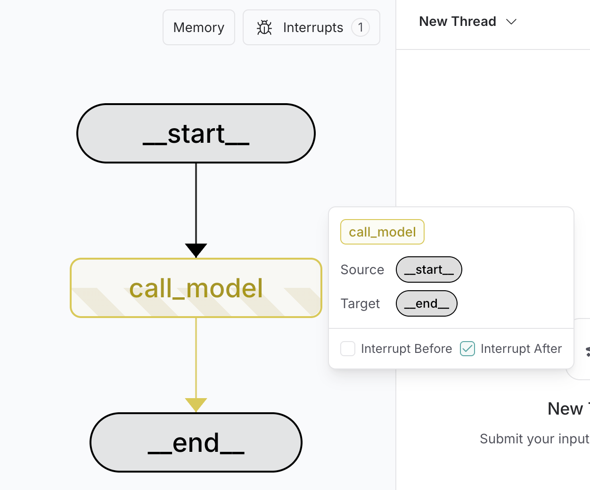

# LangGraph 学习笔记 09：Interrupts 人工介入

> 来源：<https://docs.langchain.com/oss/python/langgraph/interrupts>
>
> 这一章讲的是：图跑到一半先停下来，等人类确认后再继续。

## 一句话理解

- `interrupt()` 会在节点里主动暂停执行。
- 恢复时用 `Command(resume=...)` 把人的输入送回去。
- `thread_id` 让“暂停前的现场”可被找回。
- `stream_events()` 可以告诉你当前是不是已经暂停，以及暂停原因是什么。

## 完整 Demo

```python
from typing_extensions import TypedDict

from langgraph.checkpoint.memory import InMemorySaver
from langgraph.graph import END, START, StateGraph
from langgraph.types import Command, interrupt


class State(TypedDict):
    approved: bool


def approval_node(state: State):
    approved = interrupt("Do you approve this action?")
    return {"approved": approved}


builder = StateGraph(State)
builder.add_node("approval_node", approval_node)
builder.add_edge(START, "approval_node")
builder.add_edge("approval_node", END)
graph = builder.compile(checkpointer=InMemorySaver())

config = {"configurable": {"thread_id": "thread-1"}}

stream = graph.stream_events({"approved": False}, config=config, version="v3")
_ = stream.output
print(stream.interrupted)
print(stream.interrupts)

resumed = graph.stream_events(Command(resume=True), config=config, version="v3")
print(resumed.output)
```

## 官方页面还强调了什么

- 你可以在一个 graph 里放多个 `interrupt()`。
- `stream.interrupts` 里拿到的是暂停时的 payload。
- 人工介入不一定只是在 UI 上点“继续”，也可以接审批、风控、表单补全。
- `Command(goto=...)` 可以让恢复后的流程跳到不同分支。

## 常见模式

- 先跑自动步骤。
- 遇到关键决策点停一下。
- 人类确认后再恢复。
- 如果是审批流，可以把“通过 / 拒绝”映射到不同 node。

## 配套图


