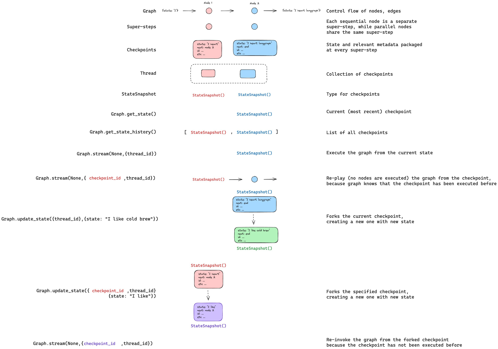
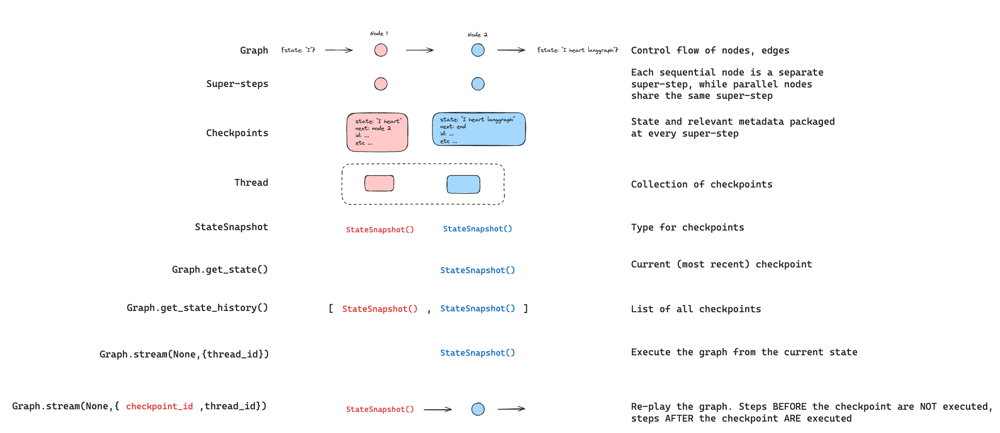

# LangGraph 学习笔记 10：Time travel 时间旅行

> 来源：<https://docs.langchain.com/oss/python/langgraph/use-time-travel>
>
> 这一章本质上就是：沿着 checkpoint 时间轴回看、回放、分叉。

## 一句话理解

- `get_state_history()` 可以把整条时间线拿出来。
- `update_state()` 可以在旧 checkpoint 上开叉。
- `invoke(None, fork_config)` 可以从这个分叉点重新跑。
- `as_node=` 可以让你决定“这次更新看起来像是谁写的”。

## 完整 Demo

```python
from typing_extensions import TypedDict, NotRequired

from langchain_core.utils.uuid import uuid7
from langgraph.checkpoint.memory import InMemorySaver
from langgraph.graph import START, StateGraph


class State(TypedDict):
    topic: NotRequired[str]
    joke: NotRequired[str]


def generate_topic(state: State):
    return {"topic": "socks in the dryer"}


def write_joke(state: State):
    return {"joke": f"Why do {state['topic']} disappear? They elope!"}


checkpointer = InMemorySaver()
graph = (
    StateGraph(State)
    .add_node("generate_topic", generate_topic)
    .add_node("write_joke", write_joke)
    .add_edge(START, "generate_topic")
    .add_edge("generate_topic", "write_joke")
    .compile(checkpointer=checkpointer)
)

config = {"configurable": {"thread_id": str(uuid7())}}
result = graph.invoke({}, config)
print(result)

history = list(graph.get_state_history(config))
before_joke = next(snapshot for snapshot in history if snapshot.next == ("write_joke",))

fork_config = graph.update_state(before_joke.config, values={"topic": "chickens"})
fork_result = graph.invoke(None, fork_config)
print(fork_result["joke"])

# 如果你希望这次修改看起来像是 generate_topic 写进去的，可以显式指定 as_node
fork_config_2 = graph.update_state(
    before_joke.config,
    values={"topic": "ducks"},
    as_node="generate_topic",
)
print(graph.invoke(None, fork_config_2)["joke"])
```

## 你会用到的几个场景

- 调试线上 bug 时，回到某个 checkpoint 重跑。
- 产品经理想看“如果我把输入改一下，系统会怎么走”。
- 审批流里要回到分支点重审。
- interrupt 暂停后，也可以拿同一套思路做重放。

## 官方图





## 这章和 checkpointers 的关系

- checkpointers 提供时间线。
- time travel 提供“沿着时间线倒回去并改写”的能力。
- 所以它不是独立机制，而是 checkpoint 能力的上层应用。
