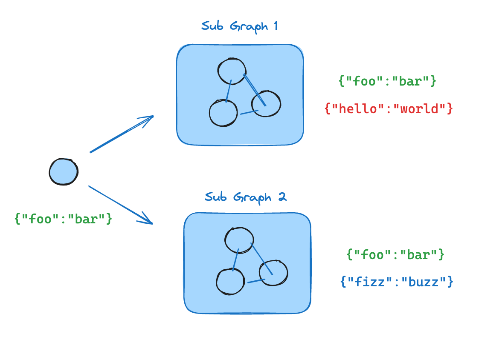

# LangGraph 学习笔记 12：Subgraphs 子图

> 来源：<https://docs.langchain.com/oss/python/langgraph/use-subgraphs>
>
> 这一章讲的是：把一个 graph 当成另一个 graph 的节点来用。

## 一句话理解

- 子图是模块化的工作流单元。
- 父图负责总调度，子图负责局部逻辑。
- 父图和子图可以共享一部分 state，也可以完全隔离。
- 子图既可以在 node 里 `invoke()`，也可以直接作为 node 注册。

## 完整 Demo

```python
from typing_extensions import TypedDict

from langgraph.graph.state import START, StateGraph


class SubgraphState(TypedDict):
    bar: str


def subgraph_node_1(state: SubgraphState):
    return {"bar": "hi! " + state["bar"]}


subgraph_builder = StateGraph(SubgraphState)
subgraph_builder.add_node("subgraph_node_1", subgraph_node_1)
subgraph_builder.add_edge(START, "subgraph_node_1")
subgraph = subgraph_builder.compile()


class ParentState(TypedDict):
    foo: str


def call_subgraph(state: ParentState):
    subgraph_output = subgraph.invoke({"bar": state["foo"]})
    return {"foo": subgraph_output["bar"]}


builder = StateGraph(ParentState)
builder.add_node("node_1", call_subgraph)
builder.add_edge(START, "node_1")
graph = builder.compile()

print(graph.invoke({"foo": "world"}))
```

## 官方页里还有两个很重要的模式

- `add_node("node_2", subgraph)`：直接把子图当节点挂上去。
- `checkpointer` + `checkpoint_ns`：让父图、子图和孙图的 checkpoint 不互相污染。

## 子图持久化怎么理解

- `stateful` + `per-invocation`：每次调用都是新的局部状态。
- `stateful` + `per-thread`：同一条 thread 上，子图也能保持状态。
- `stateless`：子图只负责计算，不记忆。

## 视角切换

- 父图看的是业务流程。
- 子图看的是局部算法。
- 这很适合把“LLM 规划”“工具调用”“后处理”拆成可维护模块。

## 配套图


